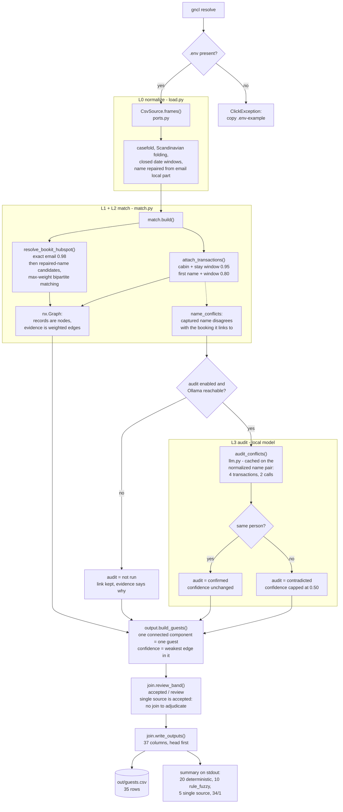
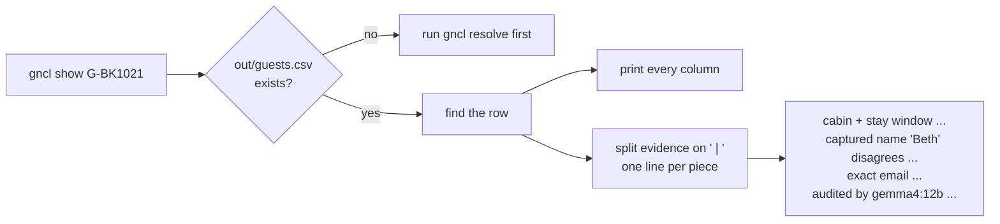
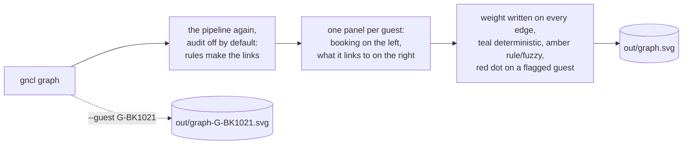
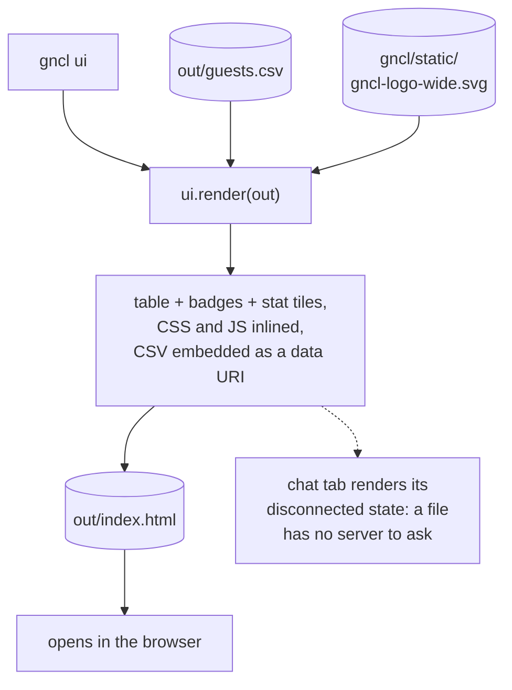
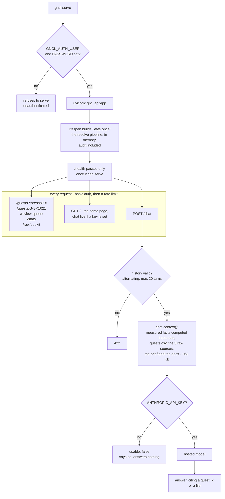
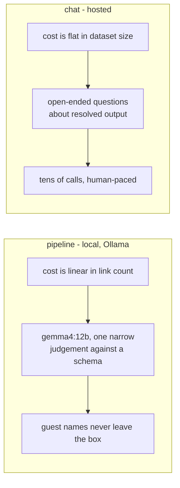

# What the commands do

The four commands in the README, drawn. Every box is a real function; the file and the layer it belongs to are named where it helps.

## `gncl resolve`

The pipeline. Reads three CSVs, writes one.

L4 is the absence of a step: a record that reaches the end unlinked is emitted as `single source` rather than forced into a pairing.

## `gncl show G-BK1021`

Reads the file the pipeline wrote. No matching happens here.

## `gncl graph`

The same components the pipeline resolved, drawn. Small multiples, because the graph is 35 components of at most five nodes and a single force-directed blob would hide the one guest resting on a weak edge.

Layout is semantic - edges only run BookIT to HubSpot and BookIT to LS Retail, so left-to-right says what the evidence is. It also makes the file deterministic, which a spring layout would not.

## `gncl ui`

One file, openable from disk, with nothing to fetch.

## `gncl serve`

The same page, plus the API, plus a chat tab that can answer.

The key never leaves the server: the browser posts a question, the server holds the credential. That is why the chat tab exists on `GET /` and not in the standalone file.

## Where the two models differ

Argued in `docs/SPECIFICATION.md` section 5.1. Both degrade in the open: with no model the audit reports `not run` and the chat says it is unconfigured, and neither silence can be read as a verdict.
